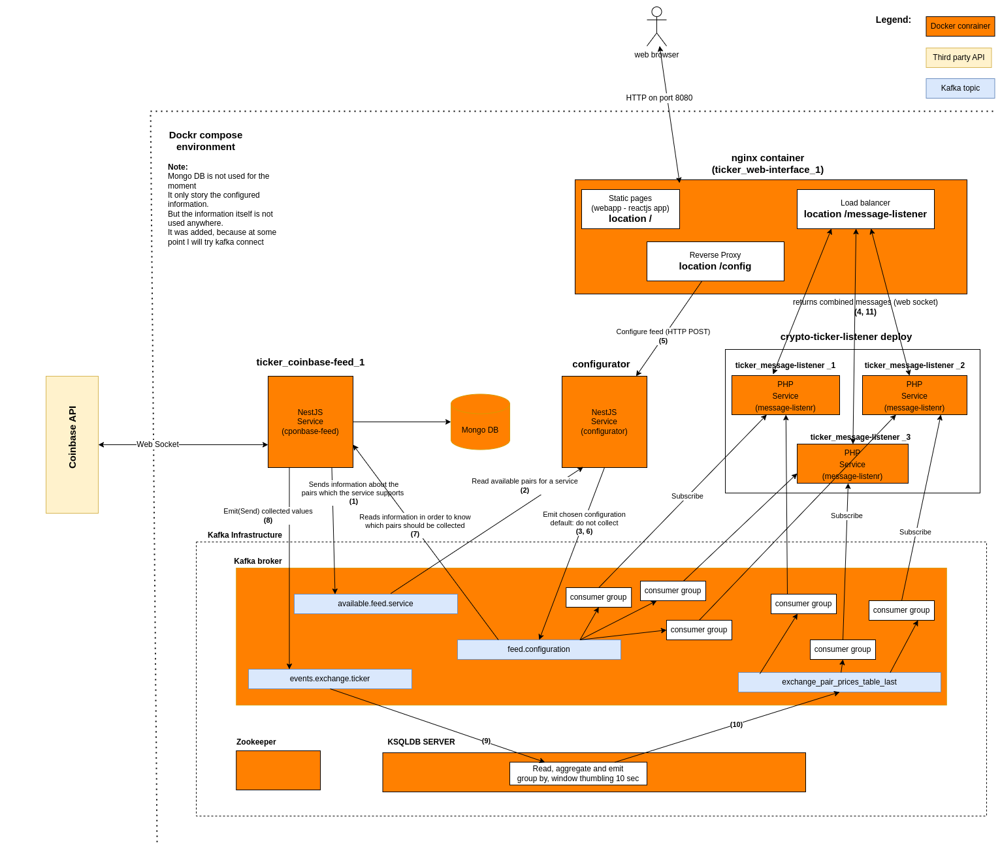

## Project info  

This is not a real world project. It doesn't bring any bussiness value.  
The purpose of the project is experimenting with micro service architecture based on NestJS, Kafka,KSQLDB, ....  
Another part of the experiment was how many long live connections (SSE) could be achieved with the current setup/techstack.  
  
Expectations:  
- single node message listener will handle ~ 23 000 SSE connections.  
- 3 nodes (current docker-compose setup) should handle more than 68 000 SEE connections.  
  
## Info  
In this pranch I am rebuilding the  (so I could experiment with WebSockets and Kafka in PHP) and the webapp (to use WebSockets instead of SSE).  
I am using:  
- Ratchet Server for handling the web sockets.  
- rxPHP (using the same reactive event loop created by the Ratched Server)  
- rdkafka  

  
## Requirements:  
Node: v14.16.1  
PHP: 8.1+
  
## docker-compose environment  
  
```
# build the images
docker-compose build --force-rm --no-cache
# run the envirnment
docker-compose -p ticker up
```

#### Imortant note 1  
Works well with docker-compose version 1.x only.  
The next versions of the docker compose somehow doesnt set the hostnames of the replica sets and the message listener is using 3 replica sets. The hostnames are used in the nginx config, so the loadbalancer won't work with docker compose version 2.x.

#### Imortant note 2
You need to wait for 30 seconds, before trying to interact with the system.  
I didn't find the time to check how I could ensure that the kafka is up and running, that's why I set it sleep 30.  
Then you could open the front-end app at: http://localhost:8080

#### Imortant note 3
**-p ticker parameter** specify the project name.  
This way the deploy of the 3 message-listener containers are prefixed with the specified project name.  
If this option is not set then they will be prefixed with the folder name and it is most likely that the nginx container exit after it starts.  
The configuration of the nginx ./docker-compose/nginx/nginx.conf depends on the names of the containers.  


#### Imortant note 4  
In the diagram bellow you will be able to see the flow.  
The "steps" are marked as (< step number >).  

#### Imortant note 5  
The benchmark on the php message listener is still not performed, so the performance could not predicted at the moment.  


   


## Development run
  
### Start Kafka / KSQLDB in docker in case you don't want to install it on your local environment  
```
cd .local-dev-docker-infrastructure
docker-compose up -d
cd ..
```
  
  
### Build the common it - is used by the rest of project  
```
cd common
npm install
npm run build
cd ..
```
  
## Build and run the app  
### you will need to have 3 console opened  
  
### Build and run the coninbase feeder  
```
cd coinbase-feed
npm install
npm run start:dev
```

### Build and run the configurator feeder  
```
cd configurator
npm install
npm run start:dev
```


### Build and run crypto-ticker-listener  
Make sure you have match all the symfony requirements  
Install composer  
```
symfony check:requirements
```
Install librdkafka-dev  
Install php rdkafka  
Configure the extension=rdkafka.so extension in php.ini for the cli  

Install dependencies:  
```
cd message-listener-php
composer install
```

Run the websocket application:  
```
php bin/console app:start-websocket -vvv  
```

### Start the webapp  
```
cd webapp
npm install
npm start
```
  
  
### Links  
  
#### The webapp  
http://localhost:3000  
Go to the Config section.  
Select which pairs should be collected by the coinbase feed service.  
Go to the second tab.  
Select the available pairs which you want to monitor.  
Clieck on subscribe.  
Wait for 10 seconds.  
Each 10 seconds the values should be updated.  


#### Confluent Control center web interface  
http://localhost:9021/clusters  


### TODOs  
- manual load tests - ( 7 docker containers, each establishing 10 000 connections to the /message-listener/api/subscribe )
- kafka connect ( maybe )
...
